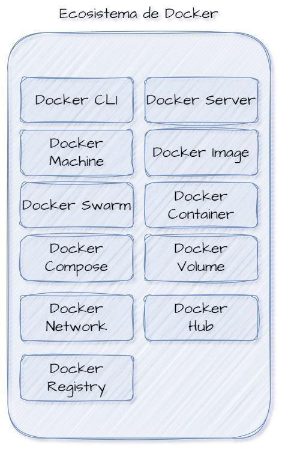

# DOCKER
Docker es una plataforma de software que proporciona una manera de automatizar el despliegue de aplicaciones en contenedores. Estos contenedores permiten a los desarrolladores empaquetar una aplicación con todas las partes que necesita, como bibliotecas y dependencias, y enviarla como un solo paquete. Esto asegura que la aplicación se ejecute de la misma manera en cualquier entorno, ya sea en desarrollo, pruebas o producción.

## ¿Por qué usar Docker?
Docker hace más sencillas las instalaciones y las configuraciones sin tener que estar preocupándonos por las dependencias.

## Ecosistema de Docker

- **Docker CLI:** Es una herramienta de línea de comandos que permite a los usuarios interactuar con Docker. Utilizando Docker CLI, puedes ejecutar comandos para construir, ejecutar y gestionar contenedores Docker, imágenes, volúmenes, y redes.
- **Docker Server (Docker Daemon):** Es un servicio en segundo plano que gestiona los objetos de Docker como imágenes, contenedores, redes y volúmenes. El daemon escucha las solicitudes de la API de Docker y las gestiona. Los usuarios interactúan con el daemon a través de la CLI de Docker o mediante clientes que usan la API de Docker.
- **Docker Machine:** Es una herramienta que te permite instalar Docker Engine en máquinas virtuales y gestionarlas. Es útil para crear servidores Docker en tu computadora local, en la nube o en un centro de datos.
- **Docker Image:** Una imagen Docker es una plantilla de solo lectura que contiene las instrucciones para crear un contenedor Docker. Incluye el código de la aplicación, bibliotecas, herramientas, dependencias y otros archivos necesarios para que una aplicación funcione.
- **Docker Swarm:** Es una herramienta de orquestación de contenedores nativa de Docker que permite a los usuarios gestionar un clúster de Docker Engines, convirtiéndolos en un único Docker Engine virtual. Proporciona funcionalidades como escalado, balanceo de carga y autorecuperación.
- **Docker Container:** Un contenedor es una instancia en ejecución de una imagen Docker. Aísla la aplicación de su entorno y garantiza que funcione de manera uniforme en cualquier plataforma.
- **Docker Compose:** Es una herramienta para definir y ejecutar aplicaciones multi-contenedor Docker. Utiliza un archivo YAML para configurar los servicios de la aplicación y permite ejecutar y gestionar todos los servicios con un único comando.
- **Docker Volume:** Los volúmenes son unidades de almacenamiento persistente utilizadas por los contenedores Docker. Permiten que los datos persistan incluso cuando los contenedores se eliminan, y también se pueden usar para compartir datos entre contenedores.
- **Docker Network:** Las redes Docker proporcionan conectividad entre los contenedores. Permiten que los contenedores se comuniquen entre sí y con el mundo exterior. Docker proporciona diferentes tipos de redes para diferentes casos de uso.
- **Docker Hub:** Es un servicio en la nube para compartir aplicaciones y automatizar flujos de trabajo. Permite a los usuarios almacenar y compartir imágenes Docker públicas o privadas y trabajar en colaboración con otros miembros del equipo.
- **Docker Registry:** Un registro Docker es un almacenamiento y distribución de imágenes Docker. Docker Hub es un ejemplo de un registro público, pero las organizaciones pueden alojar sus propios registros privados para almacenar y gestionar imágenes de manera segura.

