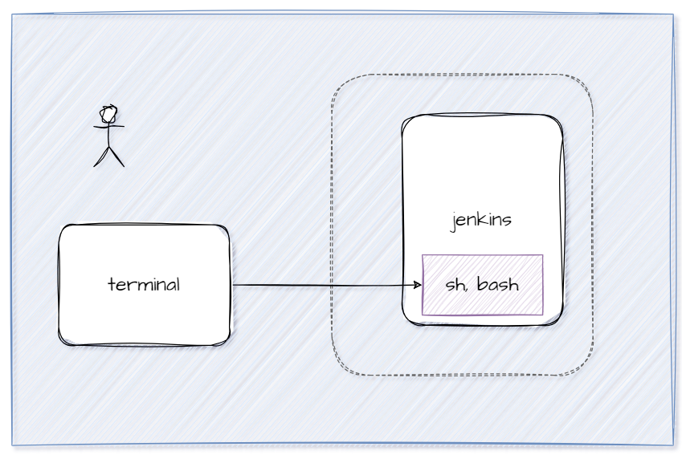

# Mapeo de Puertos 
### Usando una forma más semántica cuando se especifican puertos

```
docker run -d --name <nombre contenedor> --publish published=valor,target=valor <nombre imagen>:<tag> 
```
### Publicando todos los puertos
Esto le indica a Docker que asigne automáticamente puertos en tu host para todos los puertos expuestos por el contenedor.
```
docker run -P -d --name <nombre contenedor> <nombre imagen>:<tag> 
```

### Crear contenedor de Jenkins puertos contenedor: 8080 (interface web) y 50000 (comunicación entre nodos) imagen: jenkins/jenkins:alpine3.18-jdk11
# COMPLETAR

# COLOCAR UNA CAPTURA DE PANTALLA  DEL ACCESO http://localhost:8080

### ¿Cómo obtener la contraseña solicitada?
Para obtener la contraseña solicitada es necesario ingresar al contenedor



# Operaciones con contenedores

### Iniciando una sesión de shell dentro del contenedor de Docker en ejecución
El comando **docker exec** te permite ejecutar comandos dentro de un contenedor en ejecución.
Una vez que ejecutes este comando, estarás dentro del contenedor y podrás ejecutar comandos como si estuvieras en una terminal normal. 
Para saber qué comando utilizar para abrir una terminal dentro de un contenedor, es útil conocer la imagen base del contenedor, ya que diferentes imágenes pueden usar diferentes shells o comandos para abrir una terminal. Puedes verificar la documentación de la imagen del contenedor en Docker Hub o en el repositorio de la imagen para obtener información específica sobre cómo abrir una terminal en esa imagen.
- Para imágenes basadas en Debian o Ubuntu, puedes probar con bash.
- Para imágenes basadas en Alpine Linux, puedes probar con sh o ash.
```
docker exec <nombre contenedor> <programa o comando>
```

### Para ejecutar un shell interactivo en un contenedor de Docker especificado.
```
docker exec -i <nombre contenedor> <programa o comando>
```

### Para ejecutar un shell interactivo bidireccional en un contenedor de Docker especificado.
```
docker exec -it <nombre contenedor> <programa o comando>
```

### Para ver los logs de un contenedor

```
```

### Para crear un contenedor con variables de entorno

```
```


