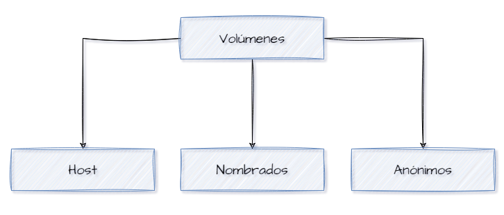

# VOLUMEN

Un volumen es un mecanismo para persistir datos generados y utilizados por contenedores. Los volúmenes son el principal método de almacenamiento para datos en Docker y permiten que los datos sobrevivan a la vida de un contenedor, se compartan entre varios contenedores y se gestionen de manera independiente del ciclo de vida del contenedor.

## Características de los volúmenes en Docker:
- Persistencia de Datos: Los datos almacenados en volúmenes no se eliminan cuando el contenedor se detiene o se elimina, a menos que se elimine el volumen explícitamente.
- Compartición de Datos: Los volúmenes pueden ser compartidos entre múltiples contenedores, lo que facilita la colaboración y el intercambio de datos entre servicios.
- Rendimiento: Los volúmenes están optimizados para el rendimiento en comparación con el uso de los sistemas de archivos montados del host.
- Backup y Restauración: Es más fácil hacer copias de seguridad y restaurar datos desde volúmenes.

## Es importante recordar que los volúmenes deben configurarse durante la creación del contenedor, ya que Docker no permite cambiar los volúmenes montados una vez que el contenedor ha sido creado