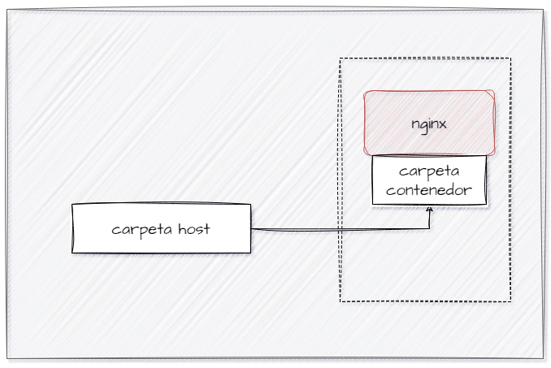

# VOLUMEN TIPO HOST
Un volumen host (o bind mount) es un tipo de volumen donde se monta un directorio o archivo específico del sistema de archivos del host en un contenedor.

```
docker run -d --name <nombre contenedor> -v <ruta carpeta host>:<ruta carpeta contenedor> <imagen> 
```

### Crear un volumen tipo host con la imagen nginx:alpine, para la ruta carpeta host: directorio en donde se encuentra la carpeta html en tu computador y para la ruta carpeta contenedor: /usr/share/nginx/html esta ruta se obtiene al revisar la se obtiene desde la documentación


docker run -d --name nginx -v C:\html:/usr/share/nginx/html:ro -p 8080:80 -p 5000:5000 nginx:alpine

### ¿Qué sucede al ingresar al servidor de nginx?
se obtiene el siguiente error (403 Forbidden)


### ¿Qué pasa con el archivo index.html del contenedor?
No se encuentra dentro del contenedor


### Ir a https://html5up.net/ y descargar un template gratuito, descomprirlo dentro de nginx/html
### ¿Qué sucede al ingresar al servidor de nginx?
Se tiene ahora la interfaz que se descargó 


### Eliminar el contenedor

docker stop nginx
docker rm nginx 

### ¿Qué sucede al crear nuevamente el mismo contenedor con volumen de tipo host a los directorios definidos anteriormente?
se mantiene la interfaz que se descargó, debido a que en la ruta, tenemos todavía el index.html y este se crea tambien en el contenedor.


### ¿Qué hace el comando pwd?
En el contexto de Docker, pwd también puede ser útil al montar volúmenes, ya que puedes usarlo para obtener la ruta absoluta del directorio actual y asegurarte de que estás especificando correctamente el directorio a montar.

Si quieres incluir el comando pwd dentro de un comando de Docker, lo puedes hacer de diferentes maneras dependiendo del shell que estés utilizando.


### Volumen tipo host usando PWD y PowerShell
```
docker run -d --name <nombre contenedor> --publish published=<valorPuertoHost>,target=<valor> -v ${PWD}/<ruta relativa>:<ruta absoluta> <nombre imagen>:<tag> 
```

### Volumen tipo host usando PWD (Git Bash)

```
docker run -d --name <nombre contenedor> --publish published=<valorPuertoHost>,target=<valor> -v $(pwd -W)/html:/usr/share/nginx/html <nombre imagen>:<tag> 
```

### Volumen tipo host usando PWD (en Linux)

```
docker run -d --name <nombre contenedor> --publish published=<valorPuertoHost>,target=<valor> -v $(pwd)/html:/usr/share/nginx/html <nombre imagen>:<tag> 
```

