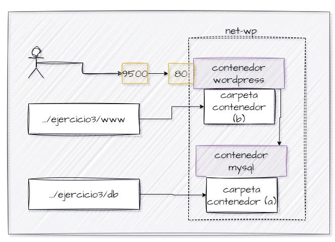

## Esquema para el ejercicio

### Crear red net-wp

docker network create net-wp

### Para que persista la información es necesario conocer en dónde mysql almacena la información.

# COMPLETAR LA SIGUIENTE ORACIÓN. REVISAR LA DOCUMENTACIÓN DE LA IMAGEN EN https://hub.docker.com/)
En el esquema del ejercicio la carpeta contenedor (a) es /var/lib/mysql
Ruta carpeta host: .../ejercicio3/db

### ¿Qué contiene la carpeta db del host?

Se encuentra vacía

### Crear un contenedor con la imagen mysql:8  en la red net-wp, configurar las variables de entorno: MYSQL_ROOT_PASSWORD, MYSQL_DATABASE, MYSQL_USER y MYSQL_PASSWORD

docker run -d --name mysql --network net-wp -e MYSQL_ROOT_PASSWORD=wordpress -e MYSQL_DATABASE=wordpress -e MYSQL_USER=wordpress -e MYSQL_PASSWORD=wordpress -v C:/ejercicio3/db:/var/lib/mysql mysql:8

### ¿Qué observa en la carpeta db que se encontraba inicialmente vacía?

Se encuentran los archivos, respectivos para el mysql

### Para que persista la información es necesario conocer en dónde wordpress almacena la información.
# COMPLETAR LA SIGUIENTE ORACIÓN. REVISAR LA DOCUMENTACIÓN DE LA IMAGEN EN https://hub.docker.com/)
En el esquema del ejercicio la carpeta contenedor (b) es /var/www/html
Ruta carpeta host: .../ejercicio3/www

### Crear un contenedor con la imagen wordpress en la red net-wp, configurar las variables de entorno WORDPRESS_DB_HOST, WORDPRESS_DB_USER, WORDPRESS_DB_PASSWORD y WORDPRESS_DB_NAME (los valores de estas variables corresponden a los del contenedor creado previamente)

docker run -d --name wordpress --network net-wp -e WORDPRESS_DB_HOST=mysql:3306 -e WORDPRESS_DB_USER=wordpress -e WORDPRESS_DB_PASSWORD=wordpress -e WORDPRESS_DB_NAME=wordpress -p 9500:80 -v C:/ejercicio3/www/html:/var/www/html wordpress

### Personalizar la apariencia de wordpress y agregar una entrada

### Eliminar el contenedor y crearlo nuevamente, ¿qué ha sucedido?

docker stop wordpress
docker rm wordpress

